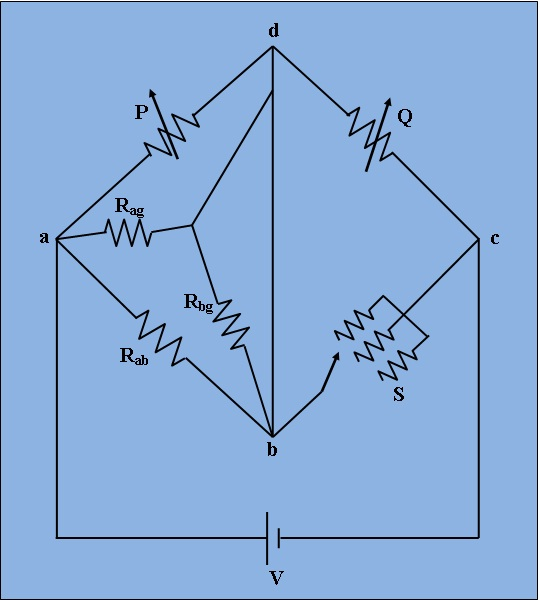

## Procedure

***Fig. 1. Circuit digram of experimental set-up for Capacitance measurement by Schering Bridge.***

1)  Applying voltage E=500V.
  
2)  Set the unknown resistance values Rab, Rag, Rbg from 'Set Unknown Resistor' tab.
  
3)  Then switch on the supply to get millivoltmeter deflection.
  
4)  Varry the values of bridge resistances P, Q, and S from the resistance box until the null deflection is occurred.
  
5)  If "NULL" is achieved, switch to 'Measure Unknown Resistor' tab and click on 'Simulate'. Observe the unknown high      resistance value Rab.
  
